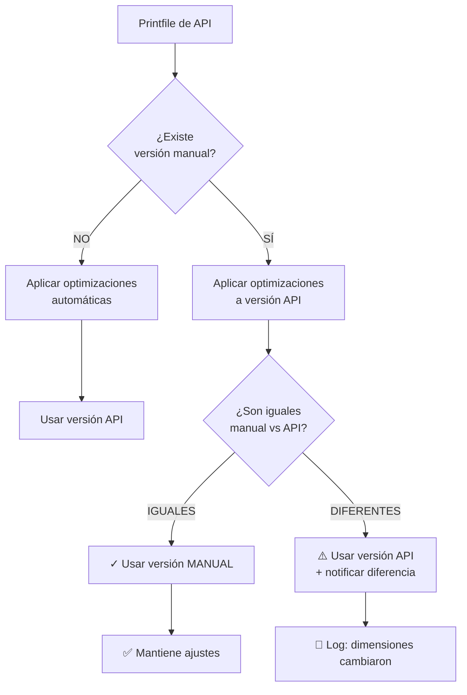

# 🔄 Flujo de Actualización Inteligente de Printfiles

## Resumen Ejecutivo

El sistema actualiza dimensiones de Printful **SOLO cuando hay cambios reales**, preservando siempre tus ajustes manuales optimizados.

---

## 📅 Timeline Diario

```
┌─────────────────────────────────────────────────────────┐
│                    TIMELINE 24H                          │
├─────────────────────────────────────────────────────────┤
│                                                          │
│  3:00 AM UTC │ Actualización Catálogo Printful          │
│              │ (productos, variantes, precios)          │
│              └──────────────────────────────────────────┤
│                                                          │
│  5:00 AM UTC │ Actualización Printfiles                 │
│              │ (dimensiones de áreas de impresión)      │
│              │                                          │
│              ├─► GitHub Actions ejecuta script          │
│              ├─► Fetch datos de Printful API            │
│              ├─► Compara con versión actual             │
│              │                                          │
│              └─► SI HAY CAMBIOS:                        │
│                  ├─► Commit a repo                      │
│                  ├─► Vercel detecta cambio              │
│                  └─► Redespliegue automático            │
│                                                          │
│  5:30 AM UTC │ Despliegue completado                    │
│              │ Nuevas dimensiones disponibles           │
│              │ (con ajustes manuales preservados)       │
│                                                          │
│  Durante     │ Caché de printfiles (1 hora)             │
│  el día      │ Requests usan versión cacheada           │
│              │ Se recarga automáticamente cada hora     │
└─────────────────────────────────────────────────────────┘
```

---

## 🧠 Lógica de Decisión

### Cuando se recibe un printfile actualizado:



---

## 🎯 Casos de Uso

### Caso 1: Sin Cambios (Lo más común)

```
┌────────────────────────────────────────┐
│ Día 1: Manual = 3600×4000, top: 800   │
│ Día 2: API    = 3600×4800, top: 0     │
│        → Optimización aplica: 800      │
│        → Resultado: IGUALES            │
│        → ✓ Usa manual                  │
│                                        │
│ Día 3: API    = 3600×4800, top: 0     │
│        → Optimización aplica: 800      │
│        → Resultado: IGUALES            │
│        → ✓ Usa manual                  │
│                                        │
│ 📊 Estado: Sin cambios, 0 deploys     │
└────────────────────────────────────────┘
```

### Caso 2: Printful Cambia Dimensiones

```
┌────────────────────────────────────────┐
│ Día 1: Manual = 3600×4000, top: 800   │
│ Día 2: API    = 3600×4800, top: 0     │
│        → Optimización aplica: 800      │
│        → Resultado: IGUALES            │
│        → ✓ Usa manual                  │
│                                        │
│ Día 3: API    = 4000×5000, top: 0  ⚠️ │
│        → Optimización aplica: 800      │
│        → Resultado: DIFERENTES         │
│        → ⚠️ Usa API (4000×4000)        │
│        → 🔔 Log: "Cambio detectado"    │
│                                        │
│ 📊 Estado: Cambio real, deploy auto   │
└────────────────────────────────────────┘
```

### Caso 3: Nuevo Placement

```
┌────────────────────────────────────────┐
│ Día 1: Manual = {front, back, sleeves} │
│ Día 2: API    = {front, back, sleeves} │
│        → Sin cambios                   │
│                                        │
│ Día 3: API    = {front, back, sleeves, │
│                  chest_pocket} ⭐      │
│        → Nuevo placement detectado     │
│        → Se añade automáticamente      │
│        → Con optimizaciones aplicadas  │
│        → 🔔 Log: "Nuevo: chest_pocket" │
│                                        │
│ 📊 Estado: Nuevo placement, deploy    │
└────────────────────────────────────────┘
```

---

## 🛡️ Optimizaciones Automáticas

Estas optimizaciones se aplican **SIEMPRE** a los datos de Printful:

### 1. Back Area (Espalda)

```typescript
// ❌ Printful envía (demasiado alta):
{ 
  placement: 'back',
  width: 3600,
  height: 4800,
  position: { top: 0, left: 0 }
}

// ✅ Sistema aplica:
{ 
  placement: 'back',
  width: 3600,
  height: 4000,        // Reducido
  position: { top: 800, left: 0 }  // Desplazado
}
```

**Razón**: Evitar que el diseño quede demasiado cerca del cuello.

### 2. Sleeves (Mangas)

```typescript
// ❌ Printful a veces envía (cuadradas - error):
{ 
  placement: 'sleeve_left',
  width: 1800,
  height: 1800
}

// ✅ Sistema corrige:
{ 
  placement: 'sleeve_left',
  width: 750,   // 2.5" @ 300 DPI
  height: 1350  // 4.5" @ 300 DPI
}
```

**Razón**: Las mangas reales no son cuadradas.

---

## 📊 Monitoreo de Cambios

### Ver si hubo cambios hoy

```bash
# Desde GitHub
GitHub → Actions → Update Printful Printfiles → Ver última ejecución

# Desde local (git)
git log --grep="Update Printful printfiles" --since="1 day ago"

# Desde Vercel
Vercel Dashboard → Deployments → Buscar "Update Printful printfiles"
```

### Logs útiles en producción

Los logs muestran qué está pasando:

```typescript
// Cuando usa manual (lo normal):
"[printfiles] Product 71 - back: Usando dimensiones manuales (iguales)"

// Cuando hay cambio (raro):
"[printfiles] Product 71 - back: Usando dimensiones de API (diferentes a manual)"

// Cuando es nuevo (ocasional):
"[printfiles] Product 71 - chest_pocket: Nuevo placement de API"
```

Accede a logs en:
- **Vercel**: Dashboard → Tu proyecto → Functions → Ver logs
- **Local**: Ejecuta `npm run dev` y verás los logs en consola

---

## 🔧 Mantenimiento

### Añadir un nuevo producto

Edita `scripts/update-printful-printfiles.mjs`:

```javascript
const PRODUCT_IDS = [
  71,   // Existing
  145,  // Existing
  999,  // ← Añadir nuevo ID
]
```

Próxima ejecución (5 AM) lo incluirá automáticamente.

### Forzar actualización manual

```bash
# Opción 1: Desde GitHub (recomendado)
GitHub → Actions → Update Printful Printfiles → Run workflow

# Opción 2: Desde local
export PRINTFUL_API_KEY="tu_key"
node scripts/update-printful-printfiles.mjs
git add mocks/printful-printfiles.json
git commit -m "chore: Manual printfiles update"
git push
```

### Invalidar caché de printfiles

```bash
# Llamar al endpoint POST
curl -X POST https://tudominio.com/api/printful/printfiles
```

---

## ⚡ Performance

### Impacto en la aplicación

- **Tamaño del archivo**: ~50-200 KB (muy pequeño)
- **Caché**: 1 hora en memoria
- **Load time**: <10ms después del primer request
- **Deploys adicionales**: Solo si hay cambios reales (raro)

### Optimizaciones aplicadas

1. ✅ Caché en memoria (1 hora)
2. ✅ Comparación inteligente (evita deploys innecesarios)
3. ✅ Carga asíncrona (no bloquea requests)
4. ✅ Fallback a dimensiones manuales si falla

---

## 🚨 Troubleshooting

### Problema: Dimensiones incorrectas después de actualización

**Solución**: Las optimizaciones deberían haberlo corregido automáticamente. Si persiste:

1. Ver logs para identificar qué cambió
2. Actualizar `OPTIMIZED_PLACEMENTS_BY_PRODUCT` con los valores correctos
3. El sistema usará tus valores manuales en la próxima actualización

### Problema: Printfiles no se actualizan

**Causas posibles**:
1. GitHub Action falló → Ver logs de Actions
2. Vercel no redesplegó → Trigger manual desde Vercel
3. Caché no invalidó → POST a `/api/printful/printfiles`

### Problema: Logs muestran "diferentes" pero son iguales

**Solución**: Revisa la lógica de comparación en `convertPrintfilesToPlacements`. 
Puede que Printful haya cambiado el formato de algún campo.

---

## 📈 Roadmap

- [ ] Dashboard visual para ver estado de dimensiones
- [ ] Alertas por email cuando hay cambios
- [ ] Histórico de cambios (diff)
- [ ] Tests automáticos de dimensiones
- [ ] Validación de que las dimensiones cumplen con límites de Printful

---

## 🔗 Enlaces Útiles

- [Printful API Docs - Printfiles](https://developers.printful.com/docs/#tag/Mockup-Generator-API)
- [GitHub Actions - Schedule](https://docs.github.com/en/actions/using-workflows/events-that-trigger-workflows#schedule)
- [Vercel Auto-Deploy](https://vercel.com/docs/deployments/git)

