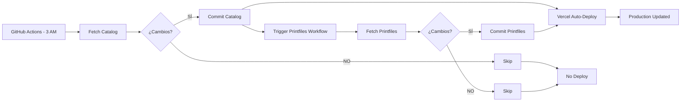

# Actualización Automática de Datos de Printful

## 📋 Resumen

El sistema actualiza automáticamente dos tipos de datos de Printful:

1. **Catálogo de Productos** - Actualizado a las **3:00 AM UTC** (4:00 AM España)
2. **Printfiles (Dimensiones)** - Actualizado a las **5:00 AM UTC** (6:00 AM España)

Ambas actualizaciones se ejecutan automáticamente via **GitHub Actions** y se guardan en la carpeta `mocks/`.

---

## 🗂️ Archivos Generados

### 1. `mocks/printful-catalog-full.json`

**Contenido:** Lista completa de productos Printful con:
- IDs de productos y variantes
- Nombres, descripciones, marcas
- Precios base en USD
- Colores y tallas disponibles
- Categorías y tipos de producto

**Tamaño aproximado:** ~15-20 MB  
**Actualización:** Diaria a las 3:00 AM UTC  
**GitHub Action:** `.github/workflows/update-printful-catalog.yml`  
**Script:** `scripts/scrape-printful-catalog.mjs`

### 2. `mocks/printful-printfiles.json`

**Contenido:** Dimensiones exactas de áreas de impresión para productos específicos:
- Dimensiones en píxeles (width, height) a 300 DPI
- IDs de printfiles para cada placement
- Available placements por producto
- Variantes y sus configuraciones

**Tamaño aproximado:** ~50-200 KB  
**Actualización:** **Solo cuando el catálogo se actualiza** (eficiencia)  
**GitHub Action:** `.github/workflows/update-printful-printfiles.yml`  
**Script:** `scripts/update-printful-printfiles.mjs`

> **Nota:** Los printfiles se actualizan automáticamente SOLO después de que el catálogo se actualice exitosamente. Esto evita requests innecesarios a la API de Printful cuando no hay cambios en productos.

---

## 🔄 Flujo de Actualización



### Orden de Actualización (Optimizado)

1. **3:00 AM UTC** - Se actualiza el catálogo completo
   - ✅ Si hay cambios → Commit + Trigger printfiles workflow
   - ⏭️ Si no hay cambios → Nada más que hacer

2. **Inmediatamente después (si hubo cambios)** - Se actualizan los printfiles
   - ✅ Si hay cambios → Commit
   - ⏭️ Si no hay cambios → Nada más que hacer

3. **Automático** - Vercel detecta cambios y redespliega
   - Solo si hubo commits en catálogo o printfiles

> **Ventaja:** Los printfiles **SOLO se actualizan si el catálogo cambió primero**. Esto ahorra requests innecesarios a la API de Printful y evita deploys cuando no hay cambios reales.

---

## 🎯 Productos con Printfiles

El sistema obtiene printfiles para **TODOS los productos del catálogo completo** de forma automática.

**Proceso:**
1. Lee `mocks/printful-catalog-full.json`
2. Extrae todos los IDs únicos de productos (~433 productos)
3. Obtiene printfiles para cada uno (si están disponibles)
4. Guarda solo los que tienen dimensiones de impresión

**Tiempo estimado:** ~2-3 minutos para 433 productos (con rate limiting de 300ms)

**Fallback:** Si el catálogo no está disponible, usa los 9 productos esenciales:
- 71 (Camiseta), 145 (Sudadera), 19 (Taza), 257/259 (Tote Bags)
- 242 (Crop Top), 92 (Gorra), 382 (Botella), 474 (Libreta)

---

## 🔧 Uso en el Código

### Prioridad de Fuentes de Datos

El sistema usa un sistema **inteligente** de prioridades para obtener dimensiones:

```typescript
// En app/api/printful/products/[productId]/route.ts

1. Printfiles del archivo (si disponible y DIFERENTES a manual)
   ↓ Si las dimensiones son IGUALES
2. OPTIMIZED_PLACEMENTS_BY_PRODUCT (lib/printful-dimensions.ts) ← Prioridad por ajustes manuales
   ↓ Si no existen
3. FALLBACK_PLACEMENTS (dimensiones genéricas)
```

### 🧠 Lógica Inteligente de Actualización

El sistema **NO sobrescribe** tus ajustes manuales a menos que Printful cambie las dimensiones:

#### Proceso de Decisión

```
┌─────────────────────────────────────┐
│ Nuevo printfile de Printful (5 AM)  │
└──────────────┬──────────────────────┘
               │
               ▼
      ┌────────────────────┐
      │ ¿Existe manual?    │
      └────────┬───────────┘
               │
        ┌──────┴──────┐
        │             │
       SÍ            NO
        │             │
        ▼             ▼
  ┌──────────┐  ┌──────────────┐
  │ Comparar │  │ Usar API +   │
  │  width   │  │ optimizaciones│
  │  height  │  └──────────────┘
  │  top     │
  └────┬─────┘
       │
  ┌────┴────┐
  │         │
IGUAL    DIFERENTE
  │         │
  ▼         ▼
┌──────┐ ┌─────────┐
│Manual│ │API + opt│
└──────┘ └─────────┘
```

#### Ejemplo Práctico

**Producto 71 (T-shirt), área "back":**

```typescript
// Tu ajuste manual (lib/printful-dimensions.ts):
{
  placement: 'back',
  width: 3600,
  height: 4000,    // ← Reducido de 4800
  position: { top: 800, ... }  // ← Desplazado hacia abajo
}

// Printful envía (actualización diaria):
{
  placement: 'back',
  width: 3600,
  height: 4800,
  position: { top: 0, ... }
}

// El sistema automáticamente aplica optimizaciones:
{
  placement: 'back',
  width: 3600,
  height: 4000,    // ← Se aplica tu ajuste
  position: { top: 800, ... }  // ← Se aplica tu ajuste
}

// Resultado: Usa tu versión manual (iguales después de optimización)
```

#### Ajustes Automáticos Aplicados

1. **Back Area**: Siempre `top: 800px` y `height: min(4000, apiHeight)`
2. **Sleeves**: Si son cuadradas (error de Printful), usar 750×1350px
3. **Nuevos Placements**: Si Printful añade un nuevo área, se agrega automáticamente con optimizaciones

### Ejemplo de Uso

```typescript
import { getOptimizedPlacementsWithPrintfiles } from '@/lib/printful-dimensions'

// En el servidor (API route)
const placements = await getOptimizedPlacementsWithPrintfiles(71)
// Devuelve dimensiones de printfiles si están disponibles,
// sino devuelve dimensiones optimizadas manualmente
```

---

## 🛠️ Ejecución Manual

### Actualizar Catálogo

```bash
# Opción 1: Desde GitHub
# Ve a GitHub → Actions → "Update Printful Catalog" → Run workflow

# Opción 2: Localmente
export PRINTFUL_API_KEY="tu_api_key"
node scripts/scrape-printful-catalog.mjs
```

### Actualizar Printfiles

```bash
# Opción 1: Desde GitHub
# Ve a GitHub → Actions → "Update Printful Printfiles" → Run workflow

# Opción 2: Localmente
export PRINTFUL_API_KEY="tu_api_key"
node scripts/update-printful-printfiles.mjs
```

---

## 📊 Monitoreo

### Ver Última Actualización

Ambos archivos JSON incluyen un campo `fetchedAt`:

```json
{
  "fetchedAt": "2025-10-11T05:00:00.000Z",
  "source": "printful",
  ...
}
```

### Verificar en GitHub Actions

1. Ve a tu repositorio en GitHub
2. Clic en la pestaña **Actions**
3. Verás el historial de ejecuciones:
   - ✅ Verde: Actualización exitosa
   - ⚪ Gris: Sin cambios
   - ❌ Rojo: Error (revisar logs)

### Logs Útiles

```bash
# Ver log de última actualización de catálogo
git log --grep="Update Printful catalog" -1

# Ver log de última actualización de printfiles
git log --grep="Update Printful printfiles" -1
```

---

## 🚨 Troubleshooting

### El catálogo no se actualiza

**Posibles causas:**
1. **API Key inválida**: Verifica que `PRINTFUL_API_KEY` esté configurada en GitHub Secrets
2. **Rate limiting**: Printful limita requests. El script usa delays de 150ms entre productos.
3. **Error de red**: Revisa los logs de GitHub Actions

**Solución:**
```bash
# Ver logs del workflow
GitHub → Actions → Update Printful Catalog → Click en la ejecución fallida
```

### Printfiles están vacíos

**Posibles causas:**
1. **Producto no soporta printfiles**: No todos los productos tienen printfiles en la API
2. **ID de producto incorrecto**: Verifica que el ID existe en el catálogo

**Solución:**
```bash
# Probar manualmente un producto
curl -H "Authorization: Bearer YOUR_API_KEY" \
  https://api.printful.com/mockup-generator/printfiles/71
```

### Cambios no se reflejan en producción

**Posibles causas:**
1. **Vercel no redesplegó**: Vercel solo redespliega si hay cambios en archivos `.js`, `.ts`, etc.
2. **Cache del navegador**: Limpia cache o usa modo incógnito

**Solución:**
```bash
# Forzar redespliegue en Vercel
vercel --prod --force
```

---

## 🔐 Secrets Requeridos

Configura estos secrets en GitHub (Settings → Secrets → Actions):

| Secret | Descripción | Dónde obtenerlo |
|--------|-------------|-----------------|
| `PRINTFUL_API_KEY` | API Key de Printful | [Printful Dashboard](https://www.printful.com/dashboard/store) |
| `GITHUB_TOKEN` | Token automático | GitHub (automático) |

---

## 📈 Mejoras Futuras

- [ ] Notificaciones por email/Slack cuando falla una actualización
- [ ] Comparación automática de cambios (diff) entre versiones
- [ ] Backup histórico de versiones anteriores
- [ ] Dashboard visual para ver estado de actualizaciones
- [ ] Webhook para notificar a Vercel inmediatamente después de actualizar

---

## 📚 Referencias

- [Printful API Docs](https://developers.printful.com/docs/)
- [GitHub Actions Cron Syntax](https://docs.github.com/en/actions/using-workflows/events-that-trigger-workflows#schedule)
- [Vercel Auto-Deploy](https://vercel.com/docs/git/vercel-for-github)

